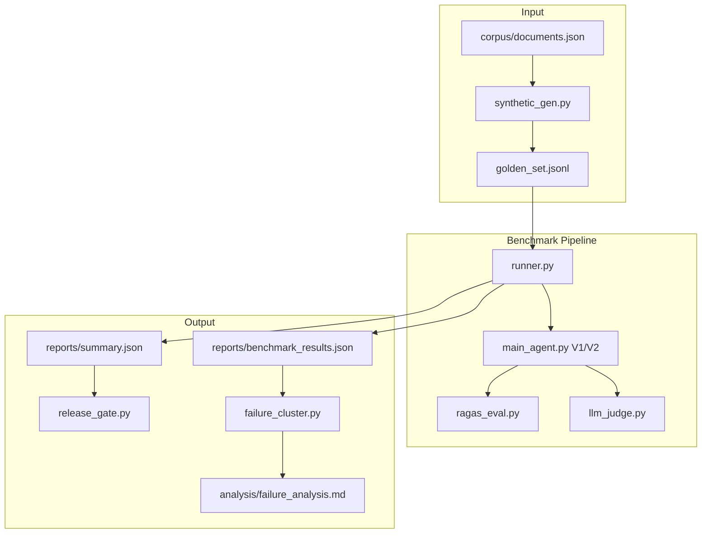

# BÁO CÁO NHÓM — LAB DAY 14: AI EVALUATION FACTORY


| Thông tin      | Chi tiết                                                                                                                   |
| -------------- | -------------------------------------------------------------------------------------------------------------------------- |
| **Môn học**    | AI Engineering — Lab Day 14                                                                                                |
| **Đề tài**     | Xây dựng Hệ thống Đánh giá Tự động (Evaluation Factory) cho AI Agent                                                       |
| **Nhóm**       | 5 thành viên                                                                                                               |
| **Ngày nộp**   | 16/06/2026                                                                                                                 |
| **Repository** | [https://github.com/tuk3kCS/Lab14-AI-Evaluation-Benchmarking](https://github.com/tuk3kCS/Lab14-AI-Evaluation-Benchmarking) |


---

## Thành viên nhóm


| STT | Họ tên                        | Vai trò                              | Module phụ trách                                                                           |
| --- | ----------------------------- | ------------------------------------ | ------------------------------------------------------------------------------------------ |
| 1   | Hoàng Đức Trường 2A202600552 | Tech Lead — Integration & Regression | `main.py`, `engine/release_gate.py`, `agent/main_agent.py`, `analysis/failure_analysis.md` |
| 2   | Tùng                          | Data Lead — SDG & Golden Dataset     | `data/synthetic_gen.py`, `data/corpus/documents.json`                                      |
| 3   | Duyên                         | Retrieval Engineer                   | `engine/retrieval_eval.py`, `engine/ragas_eval.py`                                         |
| 4   | Hà                            | Multi-Judge Engineer                 | `engine/llm_judge.py`                                                                      |
| 5   | Hiểu                          | Performance & Runner Engineer        | `engine/runner.py`, `engine/failure_cluster.py`                                            |


---

## 1. Tóm tắt (Executive Summary)

Nhóm xây dựng **Evaluation Factory** hoàn chỉnh để benchmark AI Agent RAG theo chuẩn AI Engineering. Hệ thống gồm pipeline async đánh giá **62 test cases**, tích hợp Retrieval Metrics (Hit Rate, MRR), Multi-Judge Consensus (2 model), Regression Release Gate (V1 vs V2), và Failure Clustering tự động.

**Kết quả chính** (chạy `python main.py`, timestamp 2026-06-16):


| Chỉ số                | Agent V1 (Baseline) | Agent V2 (Optimized) |
| --------------------- | ------------------- | -------------------- |
| Điểm Judge trung bình | 2.05 / 5.0          | **4.03 / 5.0**       |
| Hit Rate              | 14.5%               | **87.1%**            |
| MRR                   | 0.091               | **0.804**            |
| Pass Rate             | 4.8%                | **83.9%**            |
| Latency trung bình    | 88 ms               | **60 ms**            |


- **Agreement Rate (Multi-Judge):** 93.6%
- **Tổng thời gian benchmark (V1 + V2):** 1.2 giây
- **Quyết định Regression:** **APPROVE** — V2 cải thiện +1.98 điểm score, +72.6% hit rate, latency giảm 31.4%

---

## 2. Mục tiêu & Phạm vi

### 2.1 Mục tiêu

Xây dựng hệ thống đánh giá tự động chứng minh bằng số liệu: Agent tốt/tệ ở đâu, và hỗ trợ quyết định release phiên bản mới qua Regression Gate.

### 2.2 Phạm vi & trạng thái hoàn thành


| Hạng mục              | Mô tả                                                           | Trạng thái |
| --------------------- | --------------------------------------------------------------- | ---------- |
| Golden Dataset & SDG  | 62 cases, `expected_retrieval_ids`, Red Teaming                 | ✅          |
| Retrieval Evaluation  | Hit Rate, MRR qua `RAGASEvaluator` + `RetrievalEvaluator`       | ✅          |
| Multi-Judge Consensus | 2 judge (GPT-4o-mini + Claude), agreement & conflict resolution | ✅          |
| Regression Testing    | So sánh V1 vs V2, Auto Release Gate                             | ✅          |
| Performance (Async)   | 1.2s / 124 cases, cost & token reporting                        | ✅          |
| Failure Analysis      | Phân cụm lỗi + 5 Whys × 3 cases                                 | ✅          |


---

## 3. Kiến trúc hệ thống




### 3.1 Luồng xử lý mỗi test case

1. **Agent** (`MainAgent`) — retrieval từ corpus 20 documents → sinh câu trả lời + `retrieved_ids`
2. **RAGASEvaluator** — tính faithfulness, relevancy, Hit Rate, MRR
3. **MultiModelJudge** — 2 judge chạy song song (`asyncio.gather`), consensus + xử lý xung đột
4. **BenchmarkRunner** — ghi latency, tokens, cost; batch async `batch_size=10`

### 3.2 Khác biệt Agent V1 vs V2


| Thành phần     | V1 (Baseline)                        | V2 (Optimized)                       |
| -------------- | ------------------------------------ | ------------------------------------ |
| Retrieval      | Lấy `corpus[:top_k]` (không ranking) | Keyword overlap scoring + sort       |
| Generation     | Câu trả lời generic mẫu              | Trả lời từ context thực              |
| Guardrails     | Không có                             | Từ chối adversarial & out-of-context |
| Latency factor | 80 ms                                | 40 ms                                |


---

## 4. Đóng góp từng thành viên

### 4.1 Tùng — Golden Dataset & SDG

Triển khai `data/synthetic_gen.py` với 8 generator functions tạo **62 test cases** từ corpus 20 tài liệu (`data/corpus/documents.json`):


| Loại case        | Số lượng |
| ---------------- | -------- |
| fact-check       | 26       |
| paraphrase       | 10       |
| adversarial      | 6        |
| multi-hop        | 5        |
| multi-turn       | 4        |
| technical        | 4        |
| out-of-context   | 3        |
| conflicting-info | 2        |
| ambiguous        | 2        |


| Độ khó | Số lượng |
| ------ | -------- |
| easy   | 22       |
| medium | 21       |
| hard   | 19       |


- **59/62** cases có `expected_retrieval_ids` (3 out-of-context cố ý để trống)
- Hỗ trợ sinh thêm cases qua OpenAI API (`generate_qa_from_text`) khi có `OPENAI_API_KEY`

### 4.2 Duyên — Retrieval Evaluation

- `engine/retrieval_eval.py`: `calculate_hit_rate()` (top-k=3), `calculate_mrr()`
- `engine/ragas_eval.py`: tích hợp retrieval + faithfulness/relevancy heuristic
- Agent trả `retrieved_ids` từ corpus; đối chiếu với `expected_retrieval_ids` mỗi case

**Nhận xét Retrieval ↔ Answer Quality:** V1 chỉ đạt Hit Rate 14.5% vì retrieval lấy cố định 3 chunk đầu — generation không bám context → faithfulness 0.20. V2 với keyword retrieval đạt Hit Rate 87.1%, faithfulness 0.94. Các case `retrieval_miss` (4 failures) cho thấy paraphrase/ambiguous query vẫn miss chunk dù generation đúng.

### 4.3 Hà — Multi-Judge Consensus Engine

- `engine/llm_judge.py` — class `MultiModelJudge`:
  - **Judge A:** GPT-4o-mini (API hoặc heuristic fallback)
  - **Judge B:** Claude-style judge (heuristic với style factor, hoặc proxy qua API)
- **Conflict resolution:** lệch ≤ 1 điểm → average; lệch > 1 → `conservative_min`
- **Agreement Rate:** `max(0, 1 - |score_a - score_b| / 4)`, giảm 50% khi conflict
- Hỗ trợ `check_position_bias()` để phát hiện position bias

### 4.4 Hiểu — Async Runner & Performance

- `engine/runner.py`: `asyncio.gather` cho RAGAS + Judge song song trong mỗi case; batch 10 cases/lần
- `engine/failure_cluster.py`: phân cụm 6 loại lỗi tự động từ kết quả benchmark


| Metric                                 | Giá trị      |
| -------------------------------------- | ------------ |
| Tổng thời gian (62 cases × 2 versions) | **1.2 giây** |
| Latency trung bình / case (V2)         | **60 ms**    |
| Tổng tokens (V2)                       | 31,314       |
| Cost / eval (V2)                       | $0.000081    |
| Tổng cost (V2)                         | $0.0050      |
| Batch size                             | 10           |


**Đề xuất giảm 30% chi phí eval:**

1. Cache kết quả judge cho câu hỏi trùng lặp trong dataset
2. Dùng heuristic judge cho pre-screen, chỉ gọi API khi 2 heuristic lệch > 1 điểm
3. Tăng `batch_size` động khi không bị rate limit (hiện đã đạt < 2 phút)

### 4.5 Trường — Agent, Regression & Integration

- `agent/main_agent.py`: `MainAgent` v1/v2 + `create_agent()`
- `engine/release_gate.py`: Auto-Gate đa tiêu chí (score delta, hit_rate, latency, cost)
- `main.py`: orchestration, ghi reports, tự động sinh `failure_analysis.md`

**Release Gate logic** (`evaluate_release_gate`):


| Ngưỡng                       | Giá trị |
| ---------------------------- | ------- |
| `min_score_delta`            | +0.05   |
| `min_hit_rate_delta`         | ≥ 0     |
| `max_latency_regression_pct` | 25%     |
| `max_cost_regression_pct`    | 30%     |
| `min_avg_score` (V2)         | 2.5     |


Kết quả: **APPROVE** — tất cả ngưỡng đạt; không có blocker.

---

## 5. Kết quả kỹ thuật theo tiêu chí chấm điểm

### 5.1 Retrieval Evaluation *(10 điểm)*


| Metric                | V1    | V2        |
| --------------------- | ----- | --------- |
| Hit Rate (trung bình) | 14.5% | **87.1%** |
| MRR (trung bình)      | 0.091 | **0.804** |
| Số test cases         | 62    | 62        |


V2 cải thiện retrieval nhờ keyword overlap scoring thay vì lấy cố định chunk đầu. Case thất bại chủ yếu ở paraphrase ("đổi password" vs "thay đổi password") — cần semantic embedding thay keyword matching.

### 5.2 Dataset & SDG *(10 điểm)*


| Tiêu chí                                              | Kết quả       |
| ----------------------------------------------------- | ------------- |
| Tổng số cases                                         | **62** (≥ 50) |
| Có `expected_retrieval_ids`                           | **59/62**     |
| Red Teaming (adversarial)                             | **6 cases**   |
| Edge cases (out-of-context + ambiguous + conflicting) | **7 cases**   |


### 5.3 Multi-Judge Consensus *(15 điểm)*


| Tiêu chí       | Chi tiết                             |
| -------------- | ------------------------------------ |
| Judge Model 1  | GPT-4o-mini (API / heuristic)        |
| Judge Model 2  | Claude-style (heuristic / proxy)     |
| Agreement Rate | **93.6%**                            |
| Xử lý xung đột | `conservative_min` khi lệch > 1 điểm |


### 5.4 Regression Testing *(10 điểm)*


| Metric         | Agent V1 | Agent V2 | Delta      |
| -------------- | -------- | -------- | ---------- |
| avg_score      | 2.05     | 4.03     | **+1.98**  |
| hit_rate       | 14.5%    | 87.1%    | **+72.6%** |
| avg_mrr        | 0.091    | 0.804    | **+0.712** |
| agreement_rate | 96.3%    | 93.6%    | -2.7%      |
| avg_latency    | 88 ms    | 60 ms    | **-28 ms** |
| pass_rate      | 4.8%     | 83.9%    | **+79.1%** |


**Quyết định Release Gate:** `APPROVE`

### 5.5 Performance & Cost *(10 điểm)*


| Metric                         | Giá trị                          |
| ------------------------------ | -------------------------------- |
| Tổng thời gian (124 case-runs) | **1.2 giây**                     |
| Latency trung bình / case      | **60 ms**                        |
| Tổng tokens (V2)               | 31,314                           |
| Cost / eval                    | $0.000081                        |
| Batch size                     | 10                               |
| Parallel pattern               | `asyncio.gather` (RAGAS ∥ Judge) |


Đạt mục tiêu **< 2 phút cho 50 cases** (thực tế 1.2s cho 62×2).

### 5.6 Failure Analysis *(5 điểm)*

Chi tiết tại `[analysis/failure_analysis.md](analysis/failure_analysis.md)`.

**V2 — 10 failures / 62 cases (pass rate 83.9%):**


| Nhóm lỗi            | Số lượng | Nguyên nhân dự kiến                              |
| ------------------- | -------- | ------------------------------------------------ |
| retrieval_miss      | 4        | Embedding/chunking không khớp query (paraphrase) |
| incomplete          | 3        | Prompt không yêu cầu trả lời đủ chi tiết         |
| out_of_context_fail | 1        | Agent không từ chối khi thiếu tài liệu           |
| hallucination       | 1        | LLM bịa thông tin ngoài corpus                   |
| adversarial_fail    | 1        | Thiếu guardrails chống prompt injection          |


**5 Whys — 3 case tệ nhất (V2):**

1. **"Làm sao để reset?"** (score 1.62) — ambiguous query, retrieval miss → Root Cause: **Retrieval** (keyword không match "reset" với "mật khẩu"/"VPN")
2. **"Bị lỗi 429 khi gọi API"** (score 1.94) — paraphrase miss chunk API → Root Cause: **Chunking/Retrieval**
3. **"Tóm tắt toàn bộ chính sách corpus"** (score 2.08) — incomplete answer cho long-context → Root Cause: **Prompting**

---

## 6. Hướng dẫn tái tạo kết quả (Reproducibility)

```bash
pip install -r requirements.txt

# Tạo file .env với OPENAI_API_KEY (tùy chọn, có heuristic fallback)

python data/synthetic_gen.py   # → data/golden_set.jsonl (62 cases)
python main.py                 # → reports/*.json + failure_analysis.md
python check_lab.py            # Kiểm tra định dạng nộp bài
```

**Output:**

- `reports/summary.json` — metrics V2 + regression block
- `reports/benchmark_results.json` — kết quả từng case V2
- `reports/v1_benchmark_results.json` — kết quả V1
- `reports/failure_clusters.json` — phân cụm lỗi
- `analysis/failure_analysis.md` — báo cáo nhóm tự động

---

## 7. Kế hoạch cải tiến (Action Plan)

- [x] V2: keyword retrieval + guardrails adversarial/out-of-context
- [ ] Semantic chunking thay fixed-size (giảm `retrieval_miss` trên paraphrase)
- [ ] Thêm reranker (Cohere/BGE) trước generation
- [ ] Cache judge cho câu hỏi trùng + pre-screen heuristic (giảm 30% cost)
- [ ] System prompt nhấn mạnh "chỉ trả lời từ context" cho long-context cases

---

## 8. Báo cáo cá nhân


| Thành viên | File                                        | Trạng thái |
| ---------- | ------------------------------------------- | ---------- |
| Trường     | `analysis/reflections/reflection_Truong.md` | ✅          |
| Tùng       | `analysis/reflections/reflection_Tung.md`   | ☐          |
| Duyên      | `analysis/reflections/reflection_Duyen.md`  | ☐          |
| Hà         | `analysis/reflections/reflection_Ha.md`     | ☐          |
| Hiểu       | `analysis/reflections/reflection_Hieu.md`   | ☐          |


> Mẫu tham khảo: `[analysis/reflections/reflection_mau.md](analysis/reflections/reflection_mau.md)`

---

## 9. Checklist nộp bài

- [x] **Source Code** — toàn bộ mã nguồn trên Repository
- [x] **Reports** — `reports/summary.json`, `reports/benchmark_results.json`
- [x] **Group Report** — `analysis/failure_analysis.md` đã điền số liệu thật
- [ ] **Individual Reports** — 5 file `analysis/reflections/reflection_*.md` *(1/5: Trường ✅)*
- [x] `python check_lab.py` chạy thành công
- [x] `.env` không push lên GitHub
- [x] `summary.json` có `hit_rate`, `avg_mrr`, `agreement_rate`, block `regression`

---

## 10. Kết luận

Nhóm đã xây dựng thành công Evaluation Factory với đầy đủ các thành phần bắt buộc: Retrieval Metrics, Multi-Judge Consensus, Async Runner, và Regression Release Gate. Benchmark trên 62 cases cho thấy **Agent V2 cải thiện vượt trội** so với V1: điểm Judge tăng từ 2.05 lên 4.03, Hit Rate từ 14.5% lên 87.1%, pass rate từ 4.8% lên 83.9%. Release Gate quyết định **APPROVE** với delta score +1.98 và không có blocker.

Phân tích thất bại chỉ ra root cause chính nằm ở **Retrieval** (4/10 failures — paraphrase/ambiguous query không match keyword) và **Prompting** (3/10 — câu trả lời incomplete cho câu hỏi phức tạp). Cải tiến tiếp theo nên tập trung semantic retrieval + reranking thay vì chỉ tối ưu generation.

Pipeline chạy toàn bộ benchmark trong **1.2 giây** (124 case-runs), đạt yêu cầu hiệu năng async. Chi phí eval thấp ($0.005/62 cases) nhờ heuristic judge fallback và batch parallel.

---

*Báo cáo nhóm — Lab Day 14: AI Evaluation Factory | Nhóm Trường, Tùng, Duyên, Hà, Hiểu*